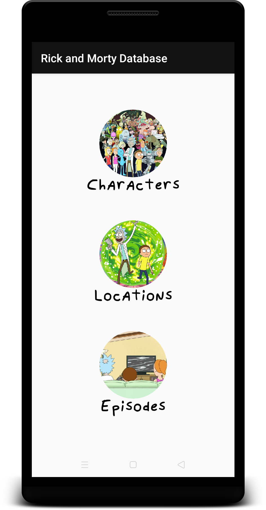
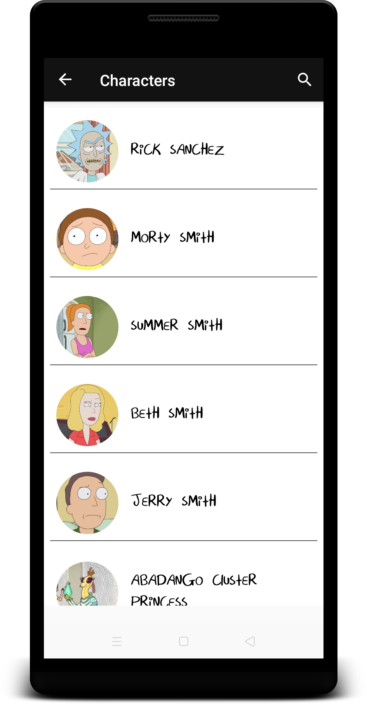
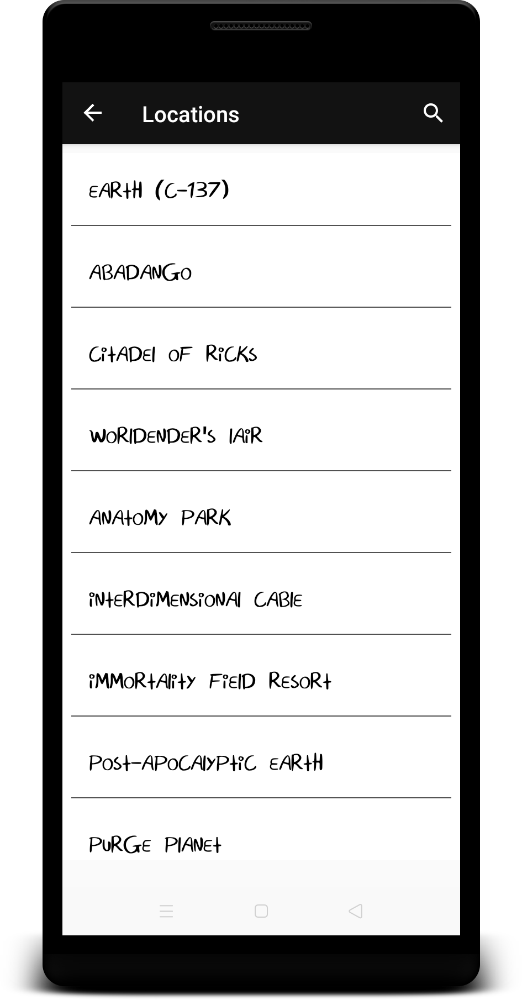
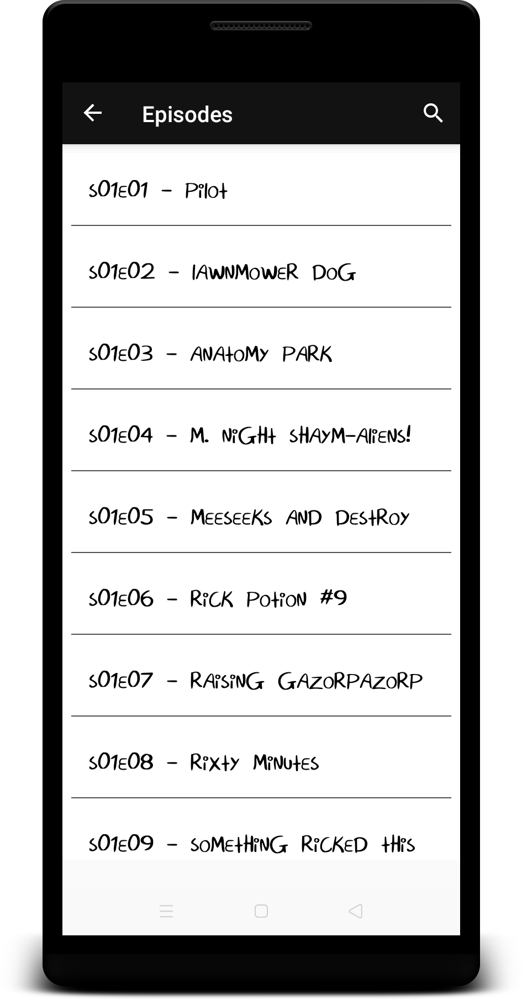
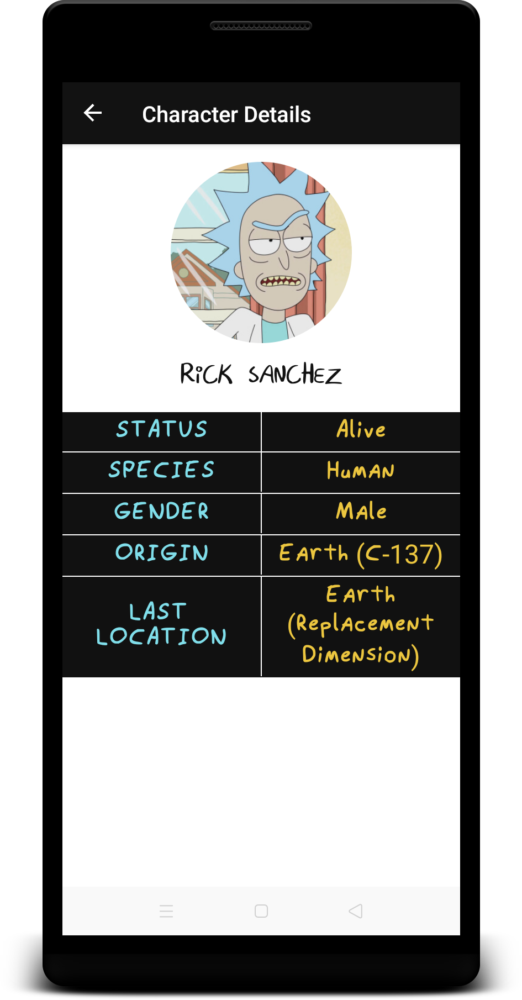

# RMDB - Rick and Morty Database
A Rick and Morty android app using jetpack architecture components.

## API:
* <a href="https://rickandmortyapi.com">Rick and Morty API</a>

## Libraries:
  ### Jetpack architecture components:
* <a href="https://developer.android.com/topic/libraries/architecture/viewmodel">ViewModel</a>
* <a href="https://developer.android.com/topic/libraries/architecture/livedata">LiveData</a>
* <a href="https://developer.android.com/topic/libraries/architecture/navigation.html">Navigation</a>
* <a href="https://developer.android.com/topic/libraries/architecture/paging/">Paging</a>
* <a href="https://developer.android.com/topic/libraries/data-binding/">Data Binding</a>

 ### Other libraries:
* <a href="https://square.github.io/retrofit/">Retrofit</a>
* <a href="https://bumptech.github.io/glide/">Glide</a>

## Screens:

  
  
  

  
  

## GIFs:

  
  
  
  
    

  
  
  
  
  

#### NOTE: I DO NOT OWN ANY ASSETS INCLUDED IN THE APP

### TODO:
* Implement caching using the <a href="https://developer.android.com/topic/libraries/architecture/room">Room</a> persistence library.
* Add more data in the details screens.
